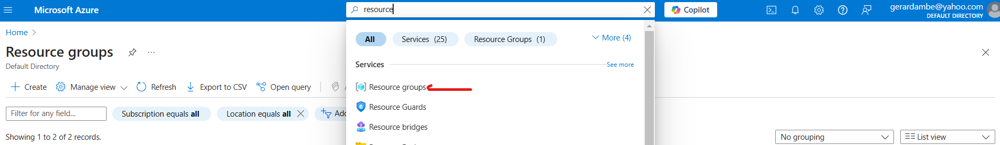

# Deploying Container Images With Azure Container Registry(ACR)


When working with Azure, setting up the right environment is the first step toward managing your applications effectively. 

In this guide, we'll walk through the process of creating: 
- ``Resource Group``
- ``Virtual Machine (VM)`` 
- ``Clone the repository``
- ``Building a Docker image``
- ``Push Image to an Azure Container Registry (ACR)``
- ``Deploy Image Azure Kubernetes Service (AKS)``

## Prerequisites
- An active Azure account.

## Create a Resource Group
A resource group is a container for managing your Azure resources. A resource group is essential because deleting a resources group will delete all the resources( eg, VM, cluster), all at once, instead of deleting them individually yourself. To create a new resource group, follow the steps below.

Go to your Azure portal and in the search bar, type ``resource`` and click on the first one.




Now click on **``Create``** and add your Resource group name as shown below:


Click on the ``Next : Tags`` button below which will take you to the tag page. Add a tag as shown below:
**Note**
    Tagging your resources is important for tracking usage and managing costs across different environments effectively. 


Then click on the **``Next:Review + create``** button, which will take you to the page shown below:


Click **``Create``**. This will create your resource group.

## Create a Virtual Machine(VM)
##### 1. Setting up
Next, we will create a VM within our resource group. In this VM we will install and configure **``kubectl``**, so we can communicate with the K8s cluter from the **CLI**. To create a VM, follow the steps below:

Go to your Azure portal and in the search bar, type ``virtual`` and click on the first one.


Click on it, then click on **``Create``**, then **``Azure Virtual machine``**

Fill the information as show below:


Leave everything as it is and click on **``Tags``**

Put in your tags, then click on **``Review + create``**.


You will see all the information about your VM to be created. Click **``Create``**


Now click on the **``Download``** button to download your RSA Key


Congratulations, That's it with setting up your VM. 

##### 2a. Connect via SSH
To connect to the VM, click on **``connect``**, **``connect``**, then click on **``Select``**

A window will pop up on the side of your screen to **``copy and execute SSH command``**

Copy the command and paste it on your Notepad.


##### 2b. Connect via CLI
Now create a folder on your PC, name it anything you want. Put the key you created into the folder. Right-click on the folder and open it using a CLI. In my case I am using Git Bash.


Write **``ls``** on the your terminal and you will be to see your key.


Now to connect to your VM. Paste the **``SSH command``** you copied before on the terminal. Replace **`` ~/.ssh/id_rsa.pem``** with your key.pem.

```sh 
ssh -i elk-vm_key.pem elk-user@20.235.147.13
```


Press **``enter``** and type **``yes``** to confirm.


Congratulations! You have now SSH into your VM and now connected to your VM from your CLI.


#### Installing Docker

```sh
# Installing Docker 
#!/bin/bash
sudo apt update
sudo apt install docker.io -y
sudo usermod -aG docker elk-user
sudo systemctl restart docker
sudo chmod 777 /var/run/docker.sock
```


## Clone the repository

To build the image locally, first we will clone the repository and cd into the flask-app directory that contains the Dockerfile and use the commands to build the docker image. Run the commands below:


```sh
git clone https://github.com/Gerardbulky/ELK-Stack-Deployment.git
```

```sh
cd ELK-Stack-Deployment/flask-app
```
Build docker image:
```sh
docker build -t flask-image:latest .
```
Run the image using:
```sh
docker run -d -p 5000:5000 flask-image:latest
```

Check if the docker image is running:
```sh
docker ps
```

<!-- ##### How It Works:
When you run a container with -p 5000:80, any traffic sent to port 5000 on the `` host `` will be forwarded to port 80 inside the container. 
**For example:**
    If the application is running inside the container on port 80, you can access it from your host machine via http://<<IP:address>>:5000  


 -->


#### Update Network Security Group Rules
In other to access our application over Port 5000, we need to update the NSG rules.

Go to ``Virtual machines``, then go to ``Network settings`` and Click on it:


Click on `` Create port rule ``


Fill the information as below and click ``Add``.


#### Access Application
Now go to your web browser, and add your Virtual machines IP Address and port 5000 as shown below:

http://<<IP:address>>:5000

## Build & Push Image To Container Registry
Azure Container Registry allows us to store, build and deploy images on Azure. We will need to create a registry to store our image.

We will need to install the Azure CLI to create our ACR account.

#### Install Azure CLI
```sh
curl -sL https://aka.ms/InstallAzureCLIDeb | sudo bash
```

```sh
az login
```

Copy the URL and paste to your favourite browser and the **code**. This will log you into your Azure account from your terminal.


You will be logged into your Azure account from the terminal. Press **Enter**


#### Create Azure Registry

Replace the ``<container_registry_name>`` with your container name. It should be in small letters and no hyphen(-) and it should be unique. My container name is ``elkcontainer``, use something else:

```sh
az acr create --resource-group elk-resource \
              --name elkregistry \
              --sku Basic \
              --tags Name=elk-tag
```
    

After creating Container Registry, you can view that by going to the Azure portal and on the search bar, type ``container registries`` and click on it.


That will take you to the ACR portal. Take note on the ``login server url`` as you will need it to push your image to your image to the container registry.


#### Build & Push Image To Container Registry 
Before pushing the image, we must authenticate with the Azure Container Registry(ACR). In the Azure CLI, run the command to log you into the ACR:

```sh
az acr login --name elkregistry
```
Build the Image:

```sh
docker build -t elkregistry.azurecr.io/flask-image:latest .
```
Push Image:
```sh
docker push elkregistry.azurecr.io/flask-image:latest
```
After the push, verify that the image is in your Azure Container Registry:
```sh
az acr repository list --name <container_registry_name> --output table
```
<!-- ## Push Image To DockerHub Registry
**1.  Log in to Docker Hub**
```sh
docker login
```
**2. Tag the Docker Image**
```sh
docker tag resume-app:latest bossmanjerry/resume-app:latest
```
**3. Push the Image**
```sh
docker push bossmanjerry/resume-app:latest
```
**4. Verify the Image on Docker Hub**
Log in to your Docker Hub account and check your repository to ensure the image is successfully uploaded. -->

## Deploying Image to AKS
To create an AKS cluster, you can follow the steps below.
If you're experienced with Azure, you can skip the networking setup. If you're new to AKS or Azure, I recommend following each step to understand the related services better.

Go to your Azure portal and in the search bar, type ``kubernetes`` and click on the first one. 


Click on **Create**, then Kubernetes cluster.


Select your resource group name. Click on "Next" to proceed.


Provide the name of your Virtual Network and click on Next.

In the ``Node pools``, update the name and click ``Update``.


In the ``Networking``, Select kubelet and Calico as Network policy.


Now go to ``Tags``, add your tag and click on ``Review + Create``


Once your deployment is complete, click on ``Go to resource``.


<!-- Click on **Connect**.

 -->


## Install Kubectl
We need to install kubectl to connect our cluster to the terminal.

```sh
curl -O https://s3.us-west-2.amazonaws.com/amazon-eks/1.28.3/2023-11-14/bin/linux/amd64/kubectl
```


```sh
curl -O https://s3.us-west-2.amazonaws.com/amazon-eks/1.28.3/2023-11-14/bin/linux/amd64/kubectl.sha256
```


```sh
sha256sum -c kubectl.sha256
```


```sh
chmod +x ./kubectl
mkdir -p $HOME/bin && cp ./kubectl $HOME/bin/kubectl && export PATH=$HOME/bin:$PATH
echo 'export PATH=$HOME/bin:$PATH' >> ~/.bashrc
```


```sh
kubectl version --client
```


## Connect Azure AKS to CLI
Go to your Azure cluster portal. Click on **Connect**
From your CLI, run both commands to connect to AKS.


Now, you can run the command to list the nodes.


```sh
kubectl get nodes
```


## Grant AKS Access to ACR
Before running the kubectl apply, we need to grant access to the ACR and to do so, we need to attach the ACR to the AKS cluster so it can pull the image.

```sh
az aks update -n elk-cluster-demo -g elk-resource --attach-acr elkregistry
```
To confirm the AKS cluster can pull images from ACR, run:

```sh
az acr list --resource-group <resource-group-name> --query "[].{acrLoginServer:loginServer}" --output table
```

It will display the ``registry login server``


## Deploy Application yaml
Now, let’s try to deploy the Apache application on AKS

From your terminal, 

```sh
nano deployment.yaml
```

Paste the code snippet. Replace  ``<container-registry-name>`` with your ACR name.

```sh
apiVersion: apps/v1
kind: Deployment
metadata:
  name: flask-deployment
  labels: 
    app: flask-app
spec:
  replicas: 2
  selector:
    matchLabels:
      app: flask-app
  template: 
    metadata:
      labels:
        app: flask-app
    spec:
      containers:
      - name: flask-container
        image: <container-registry-name>.azurecr.io/flask-image:latest
        ports:
        - containerPort: 5000
```
Press ``Ctrl + x`` to exit
Press ``y + Enter``

```sh
kubectl apply -f deployment.yaml
```


```sh
kubectl get pods
```


Now, Let's host the application outside of the Kubernetes Cluster by creating a service for the application.

```sh
nano service.yaml
```


```sh
apiVersion: v1
kind: Service
metadata:
  name: flask-service
spec:
  selector:
    app: flask-app
  type: LoadBalancer
  ports:
  - protocol: TCP
    port: 5000
```

Type ``Ctrl + x`` to exit
Type ``y + Enter``

```sh
kubectl apply -f service.yaml
```


```sh
kubectl get svc
```


Copy  the ``EXTERNAL-IP Address and paste on your favourite browser and add port 5000, to view your application Live.
